# Batch Translation API

This document explains how the batch translation API works, providing a cost-effective alternative to on-demand translation for processing large volumes of content.

## Overview

The batch translation API allows you to submit multiple translation requests as a single batch job. This approach offers:

- **Cost Savings**: Typically 50% cheaper than on-demand API calls
- **Higher Throughput**: Process large documents without rate limiting concerns
- **Asynchronous Processing**: Submit jobs and retrieve results later

### On-Demand vs Batch Comparison

| Aspect | On-Demand | Batch |
|--------|-----------|-------|
| Response Time | Immediate (seconds) | Delayed (minutes to hours) |
| Cost | Standard pricing | ~50% discount |
| Rate Limits | Per-minute limits apply | No rate limiting |
| Context Continuity | Yes (via ContextManager) | No cross-chunk context |
| Best For | Interactive use, small files | Large documents, bulk processing |

## Architecture


## Batch Processing Flow

```mermaid
sequenceDiagram
    participant Client as BatchTranslationEngine
    participant Parser
    participant Chunker as ChunkingStrategy
    participant Provider as LLM Provider
    participant API as Provider Batch API

    Client->>Parser: parse(input_file)
    Parser-->>Client: TextSegment[]

    Client->>Chunker: chunk_segments(segments)
    Chunker-->>Client: Chunk[]

    Note over Client: Build BatchRequest[] from chunks

    Client->>Provider: create_batch(requests)
    Provider->>API: Submit batch job
    API-->>Provider: batch_id
    Provider-->>Client: batch_id

    loop Poll for Completion
        Client->>Provider: get_batch_status(batch_id)
        Provider->>API: Check status
        API-->>Provider: BatchStatus
        Provider-->>Client: status, completed, total

        alt status == "completed"
            Note over Client: Exit loop
        else status == "processing"
            Note over Client: Sleep(poll_interval)
        end
    end

    Client->>Provider: get_batch_results(batch_id)
    Provider->>API: Fetch results
    API-->>Provider: Results[]
    Provider-->>Client: BatchResult[]

    Note over Client: Reconstruct translated segments
    Client->>Parser: write(segments, output_path)
</sequenceDiagram>
```

## Data Structures

### BatchRequest

Represents a single translation request within a batch:

```python
@dataclass
class BatchRequest:
    custom_id: str           # Unique identifier (e.g., "chunk-0")
    text: str                # Text to translate
    target_language: str     # Target language
    source_language: str     # Source language (optional)
```

### BatchStatus

Tracks the progress of a batch job:

```python
@dataclass
class BatchStatus:
    status: str      # "processing", "completed", "failed", "canceling"
    completed: int   # Number of completed requests
    total: int       # Total number of requests
```

### BatchResult

Contains the result for a single request:

```python
@dataclass
class BatchResult:
    custom_id: str              # Matches the request's custom_id
    translated_text: str | None # Translated content (if successful)
    error: str | None           # Error message (if failed)
```

## Provider-Specific Implementation

Each LLM provider implements batch processing differently:


### OpenAI Batch API

1. **Create**: Generates JSONL file, uploads via Files API, creates batch
2. **Status**: Queries batch endpoint for completion status
3. **Results**: Downloads output file and parses JSONL results

```
Completion Window: 24 hours
File Format: JSONL with chat completion requests
```

### Anthropic Batch API

1. **Create**: Submits requests directly to `messages.batches.create()`
2. **Status**: Queries `messages.batches.retrieve()`
3. **Results**: Iterates through `messages.batches.results()`

```
Native batch support with direct API calls
```

### Google Batch API

1. **Create**: Submits inline requests via `batches.create()`
2. **Status**: Queries batch status endpoint
3. **Results**: Fetches results from completed batch

```
Uses display_name for batch identification
```

## Chunk-to-Request Mapping

```mermaid
flowchart TD
    subgraph Chunks["Chunks from ChunkingStrategy"]
        C0["Chunk 0<br/>P1, P2, P3"]
        C1["Chunk 1<br/>Code (skip), P4"]
        C2["Chunk 2<br/>P5, P6"]
    end

    subgraph Mapping["Chunk Mapping"]
        M["chunk_mapping dict<br/>custom_id → (index, chunk)"]
    end

    subgraph Requests["BatchRequests"]
        R0["custom_id: chunk-0<br/>text: P1\\n\\nP2\\n\\nP3"]
        R1["custom_id: chunk-1<br/>text: P4"]
        R2["custom_id: chunk-2<br/>text: P5\\n\\nP6"]
    end

    C0 --> R0
    C1 --> R1
    C2 --> R2

    R0 --> M
    R1 --> M
    R2 --> M
```



**Key Points:**
- Each chunk becomes one `BatchRequest`
- `custom_id` format: `chunk-{index}`
- Non-translatable segments (e.g., code blocks) are excluded from request text
- Mapping is stored for result reconstruction

## Result Reconstruction


## Error Handling

The batch API handles failures gracefully:


**Fallback Behavior:**
- If a chunk translation fails, the original text is preserved
- Warnings are logged for failed requests
- Processing continues for remaining chunks

## Configuration

### Parameters

| Parameter | Default | Description |
|-----------|---------|-------------|
| `poll_interval` | 60 | Seconds between status checks |
| `chunk_size` | 4000 | Maximum tokens per chunk |
| `verbose` | false | Enable detailed logging |

### Usage Example

```python
from large_translate.batch_engine import BatchTranslationEngine
from large_translate.models.openai import OpenAIProvider
from large_translate.parsers.markdown import MarkdownParser

# Initialize components
provider = OpenAIProvider()
parser = MarkdownParser()
engine = BatchTranslationEngine(
    llm_provider=provider,
    parser=parser,
    chunk_size=4000,
)

# Run batch translation
stats = await engine.translate_file_batch(
    input_path=Path("large-document.md"),
    output_path=Path("translated.md"),
    target_language="Spanish",
    poll_interval=30,  # Check every 30 seconds
    verbose=True,
)

print(f"Batch ID: {stats['batch_id']}")
print(f"Chunks processed: {stats['chunks']}")
```

## Batch vs On-Demand Decision Flow


## Statistics Returned

The batch translation returns a statistics dictionary:

```python
{
    "input_chars": int,    # Total characters in input
    "output_chars": int,   # Total characters in output
    "chunks": int,         # Number of chunks processed
    "batch_id": str,       # Provider's batch job ID
}
```

## Key Differences from On-Demand

| Feature | On-Demand | Batch |
|---------|-----------|-------|
| ContextManager | Used for continuity | Not used |
| Retry Logic | Exponential backoff | Provider handles |
| Progress | Per-chunk updates | Polling-based |
| Error Recovery | Immediate retry | Logged, original preserved |
| Chunk Processing | Sequential | Parallel (provider-side) |

## Limitations

1. **No Cross-Chunk Context**: Unlike on-demand, batch processing doesn't pass context between chunks
2. **Delayed Results**: Results are not immediate; polling is required
3. **Provider Limits**: Each provider has batch size and time limits
4. **No Partial Results**: Must wait for entire batch to complete
