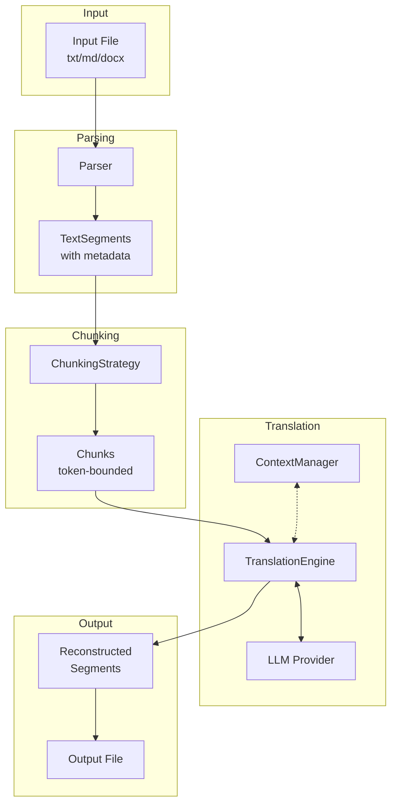
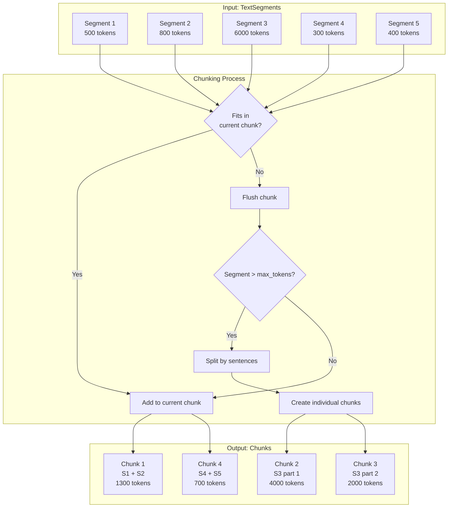
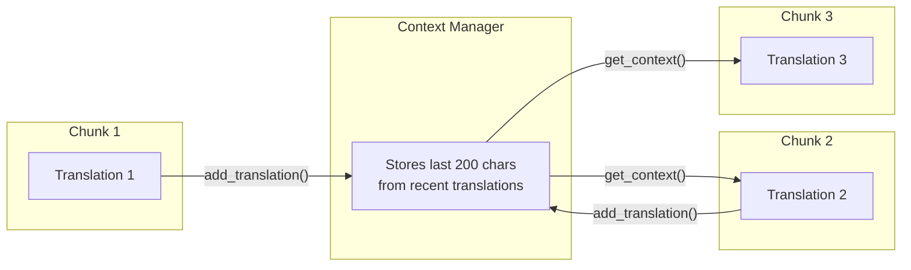
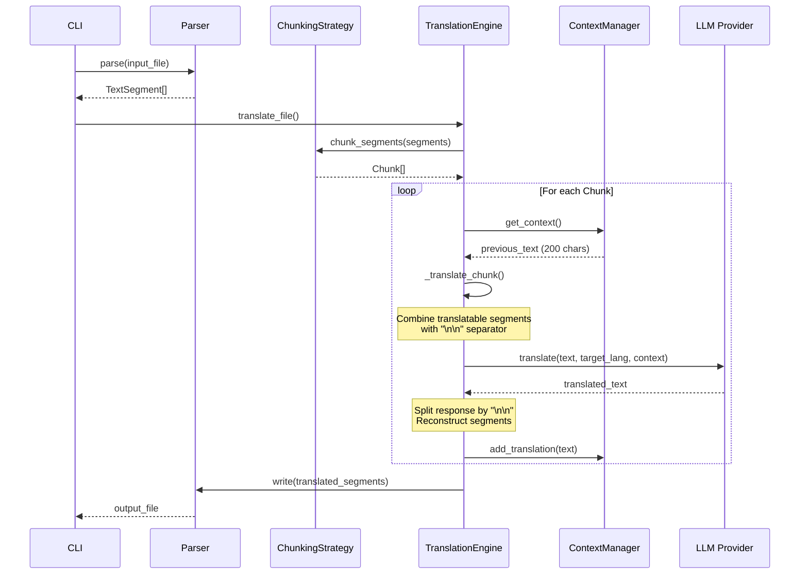
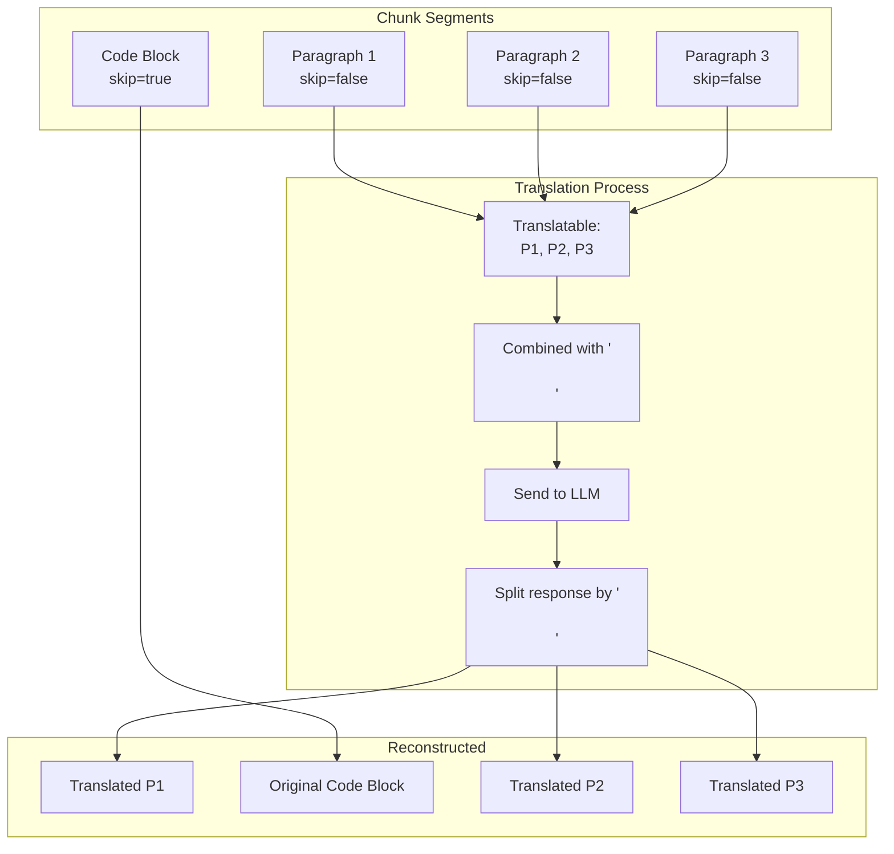
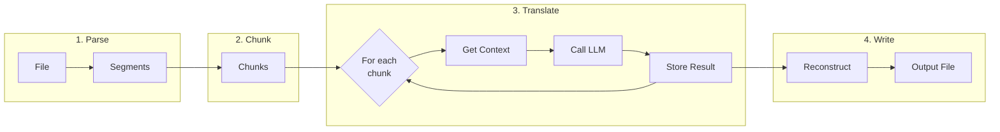

# On-Demand Translation API with Chunking

This document explains how the large-translate on-demand translation API works, with a focus on the intelligent chunking mechanism that enables translation of large files.

## Overview

The on-demand translation API provides real-time translation of documents using LLM providers. It handles large files by intelligently splitting content into manageable chunks while preserving context and formatting.

### Supported File Formats
- **Plain Text** (`.txt`) - Simple paragraph-based splitting
- **Markdown** (`.md`) - Preserves headers, code blocks, links, and formatting
- **Word Documents** (`.docx`) - Maintains styles, fonts, and run formatting

### Supported LLM Providers
| Provider | Model | Max Context | Max Output |
|----------|-------|-------------|------------|
| OpenAI | gpt-5.2 | 128,000 tokens | 16,384 tokens |
| Anthropic | claude-sonnet-4-5 | 200,000 tokens | 8,192 tokens |
| Google | gemini-3-flash-preview | 1,000,000 tokens | 8,192 tokens |

## High-Level Architecture



## Chunking Strategy

### Why Chunking is Needed

LLM providers have token limits for both input and output. A large document might exceed these limits, causing API failures. The chunking strategy:

1. **Respects token limits** - Each chunk stays within the configured `max_tokens`
2. **Preserves paragraph boundaries** - Never splits mid-paragraph
3. **Handles oversized content** - Splits large segments by sentences
4. **Maintains context** - Passes previous translation context between chunks

### How Chunking Works



### Chunking Rules

1. **Accumulation**: Segments are accumulated until adding another would exceed `max_tokens`
2. **Overflow Handling**: When limit is reached, current chunk is flushed and a new one starts
3. **Large Segment Splitting**: Segments exceeding `max_tokens` are split by sentence boundaries
4. **Skip Preservation**: Segments marked `skip_translation=True` (e.g., code blocks) are included but not translated

### Token Counting

Each provider implements token counting differently:

| Provider | Method |
|----------|--------|
| OpenAI | Precise counting via `tiktoken` library |
| Anthropic | Estimate: `len(text) // 4` |
| Google | Estimate: `len(text) // 4` |

## Context Preservation

The `ContextManager` maintains translation continuity across chunks by passing context from previous translations.



### How Context Works

1. **First Chunk**: No context provided (starts fresh)
2. **Subsequent Chunks**: Last 200 characters from previous translations are included
3. **Sentence Boundary Respect**: Context is truncated at sentence boundaries for clarity
4. **Prompt Integration**: Context is added as `[Previous context for consistency: ...]`

## Translation Flow



## Chunk Processing Detail

### Segment Separation

When processing a chunk, segments are categorized:



### Retry Logic

Translation uses exponential backoff for resilience:

```
Retry Strategy:
- Max attempts: 5
- Backoff: Exponential (wait=1, wait_multiplier=2)
- Handles: Rate limits, temporary failures
```

## Configuration Options

### CLI Parameters

| Parameter | Default | Description |
|-----------|---------|-------------|
| `--chunk-size` | 4000 | Maximum tokens per chunk |
| `--model` | openai | LLM provider (openai/anthropic/google) |
| `--source` | auto | Source language (optional) |
| `--verbose` | false | Enable detailed logging |

### Example Usage

```bash
# Basic translation
large-translate translate input.md spanish

# Custom chunk size for large files
large-translate translate large-doc.docx french --chunk-size 8000

# Using Anthropic with verbose output
large-translate translate article.txt german --model anthropic --verbose
```

### Choosing Chunk Size

| Scenario | Recommended Size | Reason |
|----------|------------------|--------|
| Short documents | 4000 (default) | Balanced performance |
| Long documents | 8000-16000 | Fewer API calls |
| Complex content | 2000-4000 | Better context handling |
| Technical docs | 4000 | Preserves code blocks well |

## Data Flow Summary



## Key Components Reference

| Component | File | Purpose |
|-----------|------|---------|
| TranslationEngine | `engine.py` | Orchestrates translation flow |
| ChunkingStrategy | `chunking.py` | Token-aware segmentation |
| ContextManager | `chunking.py` | Cross-chunk continuity |
| BaseLLMProvider | `models/base.py` | Provider interface |
| BaseParser | `parsers/base.py` | Format parsing interface |
| TextSegment | `parsers/base.py` | Data transport object |
